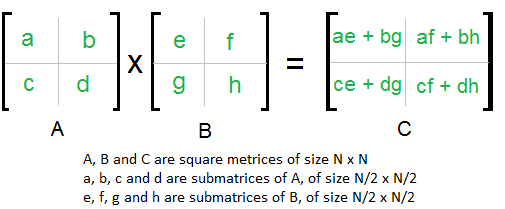

### Divide and Conquer 

Following is simple Divide and Conquer method to multiply two square matrices.
- 1. Divide matrices A and B in 4 sub-matrices of size N/2 x N/2 as shown in the below diagram.
- 2. Calculate following values recursively. ae + bg, af + bh, ce + dg and cf + dh.

__T(N) = 8T(N/2) + O(N2)__  

From Master's Theorem, time complexity of above method is O(N3)
which is unfortunately same as the above naive method.

### Simple Divide and Conquer also leads to O(N3), can there be a better way?

In the above divide and conquer method, the main component for high time 
complexity is 8 recursive calls. The idea of Strassen’s method is to reduce the 
number of recursive calls to 7. Strassen’s method is similar to above simple 
divide and conquer method in the sense that this method also divide matrices 
to sub-matrices of size N/2 x N/2 as shown in the above diagram, but in Strassen’s method, 
the four sub-matrices of result are calculated using following formulae.
 

__T(N) = 7T(N/2) +  O(N2)__

From Master's Theorem, time complexity of above method is O(NLog7) which is 
approximately O(N2.8074)